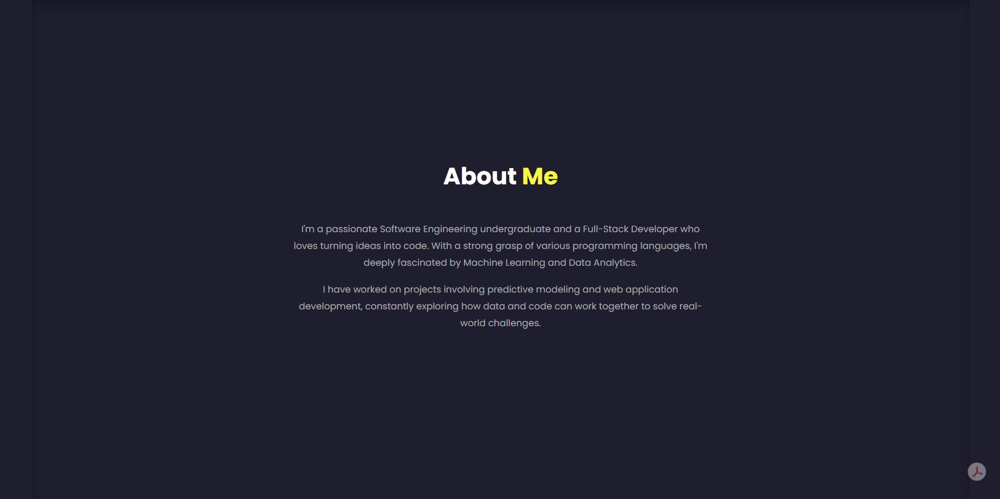
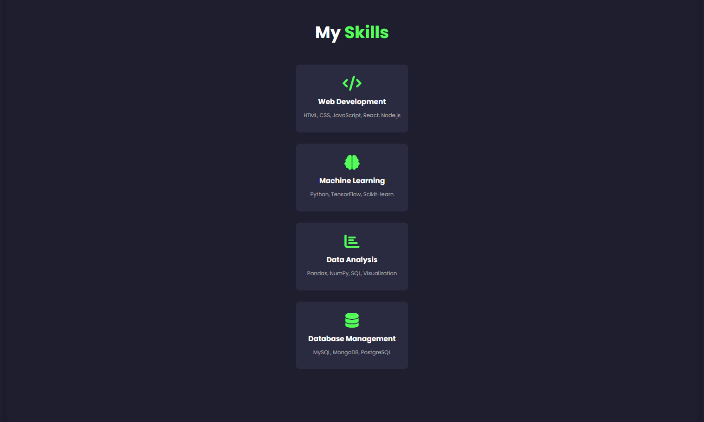
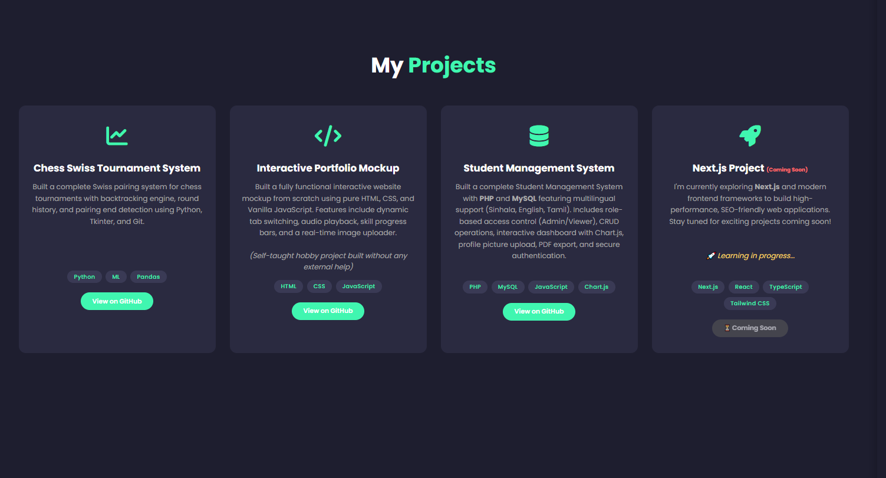
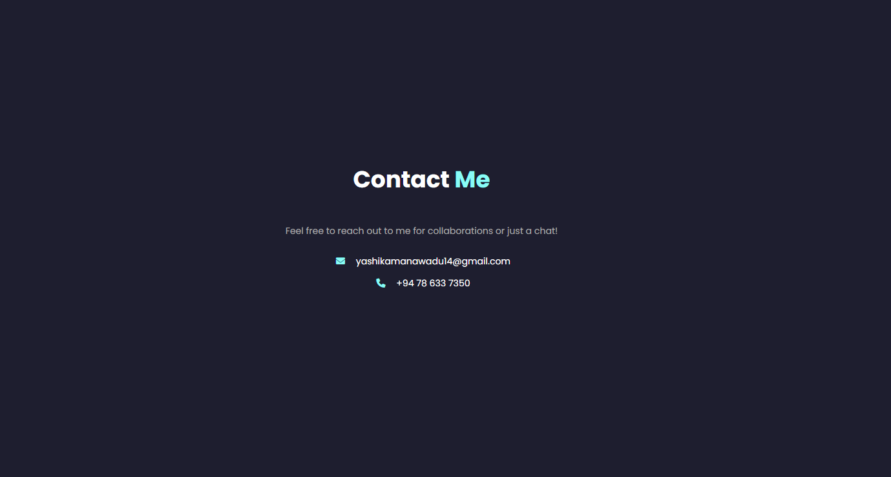

# 🎨 Yashika Kaumina - Portfolio Website

👁️ [**Live Demo**](https://yashika-kaumina.github.io/my-portfolio-practice/)

---

## 📖 Overview

Welcome to my **personal portfolio website**! This is a fully responsive, modern portfolio built from scratch using **HTML5**, **CSS3**, and **Vanilla JavaScript**. It showcases my skills, projects, and professional journey as a Software Engineering undergraduate and Full-Stack Developer.

---

## ✨ Features

### 🎨 Design & UI
- 🌙 **Dark Theme** - Sleek and modern dark color scheme
- 📱 **Fully Responsive** - Optimized for mobile, tablet, and desktop
- 🎬 **Typewriter Animation** - Dynamic text animation in hero section
- 🎯 **Smooth Scrolling** - Seamless navigation between sections
- 🖱️ **Hover Effects** - Color-coded navigation links and card animations

### 📑 Sections
| Section | Description |
|---------|-------------|
| 🏠 **Home** | Hero section with profile photo, typewriter animation, and social links |
| 👤 **About** | Personal introduction and background |
| ⚡ **Skills** | Display of technical skills and expertise |
| 🚀 **Projects** | Showcase of featured projects with technology tags |
| 📞 **Contact** | Contact information and social media links |

### 🛠️ Interactive Elements
- ⌨️ **Typing Animation** - Rotating words in the hero section
- 🔗 **Download CV** - Direct PDF resume download
- 🌐 **Social Media Links** - GitHub, LinkedIn, Facebook, Twitter, Instagram
- 🎯 **Project Cards** - Hover effects and GitHub links

---

## 🛠️ Technologies Used

| Category | Technologies |
|----------|-------------|
| **Frontend** | HTML5, CSS3, JavaScript (Vanilla) |
| **Icons** | Font Awesome 6 |
| **Fonts** | Google Fonts - Poppins |
| **Hosting** | GitHub Pages |
| **Version Control** | Git & GitHub |

---

## 📁 Project Structure

📂 **my-portfolio-practice/**

├── 📄 `index.html` - Main HTML file

├── 🎨 `style.css` - Stylesheet

├── ⚡ `script.js` - JavaScript functionality

├── 🖼️ `profile_pic.jpg` - Profile photo

├── 📄 `YASHIKA.pdf` - Resume/CV

└── 📝 `README.md` - This file


---

## 🚀 Getting Started

### Prerequisites
- Any modern web browser (Chrome, Firefox, Edge, Safari)
- Git (for cloning)

### Installation

1. **Clone the repository**
  ```bash
git clone https://github.com/Yashika-Kaumina/my-portfolio-practice.git
cd my-portfolio-practice
```

---

## 📸 Screenshots

### 🏠 Home Section


### 🚀 AboutMe Section


### 🚀 Skills Section


### 🚀 Projects Section


### 🚀 Contact Section

   
